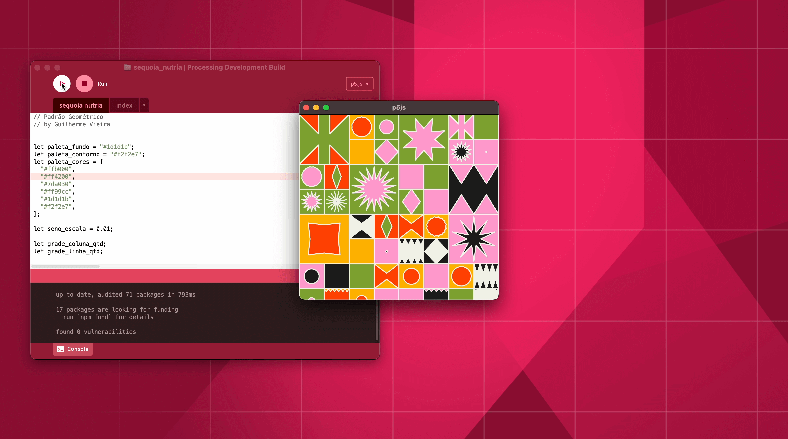

# Processing P5 JS mode

I'd like to build a p5.js mode for the Processing editor based around Electron. This will allow p5.js sketches to run with local desktop permissions, including access to the file system, integration with Node.js modules, and the ability to create standalone desktop apps. The goal of this mode is to provide as close to native support for p5.js within the Processing Development Environment (PDE) as possible.

## Running the POC
This proof of concept is currently set up for macOS only. Support for other platforms will be added later. The mode assumes that Processing is installed in `/Applications/Processing.app`

- Open this repository in Intellij IDEA
- Goto File->Project Structure->Project Settings->Project and set the SDK to `temurin-17`
- Wait for Gradle to download its things
- Run the Gradle task `runProcessing`
  - This will install the library in `~/Documents/Processing/Modes/p5js`
  - This will run a funky version of Processing

_Screenshot of the proof of concept, featuring a sketch by Guilherme Vieira._

### Ideal functionality (in order of importance)
- Wrap p5.js sketches in Electron (in poc)
- Access Node.js functionality (in poc)
- Start and stop from the editor (in poc)
- Launch devtools from button in the editor
- Toggle to enable/disable hot-reload
- Proper editor support  (ideally the p5.js web editors React Component)
  - Syntax highlighting
  - Auto-complete
  - Error highlighting
  - etc...
- Download npm packages (and other package repos) with UI
- Export p5 sketches to standalone apps
- Typescript support for sketches

### Known issues in POC
- Run button does not accurately reflect state of running app
- Running the sketch crashes if `npm install` is still running in the background
- General code quality
- Code lines do not work
- `Enter` key does not work
- No UI for adding libraries
- Sketch window is stuck at a certain size

### Technical challenges
- For optimal support we should connect a Java based JS debugger to the Electron app
- I'd like to have all our custom JS functionality to also be a proper JS project setup within this repo, not like I did it in the POC with some .js and .html files embedded as strings in the code.
- Not having a node_modules folder per sketch would be awesome
  - My current thinking is that we could have a single `node_modules` setup in the sketchbook, Electron would be run from there and also that's where any installed npm packages would be installed to.
  - I thought of installing everything in `global` namespace, but I think that will cause issues and also be a little bit insecure.
- Including new functionality into p5 related to the electron bases
  - e.g Overwriting `createCanvas` to send a signal to electron to resize the window to the newly defined size.
 
### What I need help with
- My (Stef) focus is learning how Processing modes are developed. Details on the implementation on how to run `npm` within Java is less relevant to my goals within Processing (still very interesting)

### Future plans
- iOS wrapper
- Android wrapper

This technique of wrapping a p5.js sketch in a runner (e.g. in the poc, `electron`) can also be applied to other platforms such as iOS and Android, providing a simple way for people to install their sketches as iOS and Android apps.
- Export as GitHub ready
  - Include automated actions to compile the sketch to native apps
  - Include a `package.json`
  - Remove any Processing file that would interfere
